# 🍌 Awesome **Nano Banana Pro** Prompts & Examples Gallery

⭐ Please Star or Watch this project for future updates!

last updated: Nov 27th 2025. 

## 💡 Where can I try Nano Banana Pro?
It is recommended to start for free on [Copictor.com](https://copictor.com/) with a collection of artist-crafted built-in prompts.

## 🔍 Introduction
awesome-nano-banana-pro-images is a curated, community-driven collection of high-quality prompts and stunning outputs generated with the **Nano Banana Pro (Google Gemini 3 Pro Image Preview)** model.  
This repository aims to help creators, researchers, and prompt engineers better understand how to craft effective prompts for the model during its pre-release phase.


## 📌 What This Repository Contains
- Community-shared prompts that produce high-quality or interesting results  
- Example images generated via official and third-party Nano Banana Pro endpoints  
- Notes, tips, and reverse-prompt insights from real-world usage  

## 🎯 Purpose
This project serves as a practical reference for anyone experimenting with the Nano Banana Pro model. By collecting public examples and prompts from across the community, we aim to:
- Showcase what the model can achieve  
- Explore prompt patterns that lead to strong outputs  
- Help users learn and iterate faster  


## 🖼️ Prompt Gallery

- [✨ Cases list](#️-cases)
  - [Case 1: Turn movie into a series of Polaroid photos pinned to a cork board（by @umesh_ai）](#case-1-turn-movie-into-a-series-of-polaroid-photos-pinned-to-a-cork-boardby-umesh_ai)
  - [Case 2: Solve math problem on whiteboard（by @mark_k）](#case-2-solve-math-problem-on-whiteboardby-mark_k)
  - [Case 3: Assemble message from torn and mixed-up pieces（by @ai_for_success）](#case-3-assemble-message-from-torn-and-mixed-up-piecesby-ai_for_success)
  - [Case 4: Anime style to Live-action image（by @wanerfu）](#case-4-anime-style-to-live-action-imageby-wanerfu)
  - [Case 5: Live-action image to Anime style（by @TWnese）](#case-5-live-action-image-to-anime-styleby-twnese)
  - [Case 6: Watercolor-ink style series comic（by @ZizheRuan）](#case-6-watercolor-ink-style-series-comicby-zizheruan)
  - [Case 7: Futuristic commercial website advertisement with text（by @ZizheRuan）](#case-7-futuristic-commercial-website-advertisement-with-textby-zizheruan)
  - [Case 8: Create picture by location and time（by @minchoi）](#case-8-create-picture-by-location-and-timeby-minchoi)
  - [Case 9: Recursive photograph with time stamp（by @goodside）](#case-9-recursive-photograph-with-time-stampby-goodside)
  - [Case 10: Traditional color ink painting with modern cartoon characters（by @dotey）](#case-10-traditional-color-ink-painting-with-modern-cartoon-charactersby-dotey)
  - [Case 11: Hand drawn schematic diagram from photo（by @alisa_fortin）](#case-11-hand-drawn-schematic-diagram-from-photoby-alisa_fortin)
  - [Case 12: Photo style picture from hand drawn schematic diagram（by @citychittagong1）](#case-12-photo-style-picture-from-hand-drawn-schematic-diagramby-citychittagong1)
  - [Case 13: Hand drawn schematic diagram from text（by @alloysiusattah）](#case-13-hand-drawn-schematic-diagram-from-textby-alloysiusattah)
  - [Case 14: Hand-drawn white outlines to depict figure pose（by @ZeroZ_JQ）](#case-14-hand-drawn-white-outlines-to-depict-figure-poseby-zeroz_jq)
  - [Case 15: A two-panel technical blueprint diagram（by @egeberkina）](#case-15-a-two-panel-technical-blueprint-diagramby-egeberkina)
  - [Case 16: 3D fluffy logo（by @gizakdag）](#case-16-3d-fluffy-logoby-gizakdag)
  - [Case 17: Landmark Infographics（by @TechieBySA）](#case-17-landmark-infographicsby-techiebysa)
  - [Case 18: Google map style graphics（by @alex_prompter）](#case-18-google-map-style-graphicsby-alex_prompter)
  - [Case 19: 3D Topology（by @alex_prompter）](#case-19-3d-topologyby-alex_prompter)
  - [Case 20: Inner scientific machines（by @alex_prompter）](#case-20-inner-scientific-machinesby-alex_prompter)
  - [Case 21: Scientific Scatter Plot（by @alex_prompter）](#case-21-scientific-scatter-plotby-alex_prompter)
  - [Case 23: 8-bit style map（by @Mr_AllenT）](#case-23-8-bit-style-mapby-mr_allent)
  - [Case 24: rate your face symmetry（by @Samann_ai）](#case-24-rate-your-face-symmetryby-samann_ai)
  - [Case 25: Age checker（by @Samann_ai）](#case-25-age-checkerby-samann_ai)
  - [Case 26: Draw language learning scenario picture（by @crystalsssup）](#case-26-draw-language-learning-scenario-pictureby-crystalsssup)
  - [Case 27: Create a realistic photo of a cartoon character（by @gizakdag）](#case-27-create-a-realistic-photo-of-a-cartoon-characterby-gizakdag)
  - [Case 28: Restore sketches from logo（by @riomadeit）](#case-28-restore-sketches-from-logoby-riomadeit)
  - [Case 29: Solve math question on notebook（by @immasiddx）](#case-29-solve-math-question-on-notebookby-immasiddx)
  - [Case 30: Recreate Britney at VMAs（by @shoolian）](#case-30-recreate-britney-at-vmasby-shoolian)
  - [Case 31: Turn item into cyberpunk style with text（by @ZizheRuan）](#case-31-turn-item-into-cyberpunk-style-with-textby-zizheruan)

## ✨ Cases

### Case 1: [Turn movie into a series of Polaroid photos pinned to a cork board](https://x.com/umesh_ai/status/1993247403995283687)（by [@umesh_ai](https://x.com/umesh_ai)）

| Input | Output |
|:---:|:---:|
| 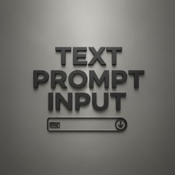 | 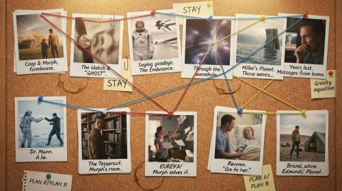 |


**input:** text prompt only

**prompt:**

```
Create an image about "[FILM_OR_NOVEL]" retold through a series of Polaroid photos pinned to a cork board. Each photo captures a key moment, with simple captions below. Arrange the photos in a loosely chronological path across the board, using colored strings to connect events and characters. Light the scene warmly to evoke nostalgia. Include incidental details, coffee cup rings, paper clips, handwritten notes, for authenticity.
```

<!-- Case 2: Solve math problem on whiteboard (by @mark_k) -->
### Case 2: [Solve math problem on whiteboard](https://x.com/mark_k/status/1987822081363583381)（by [@mark_k](https://x.com/mark_k)）

| Input | Output |
|:---:|:---:|
| 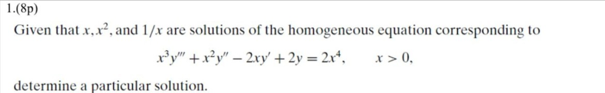 | 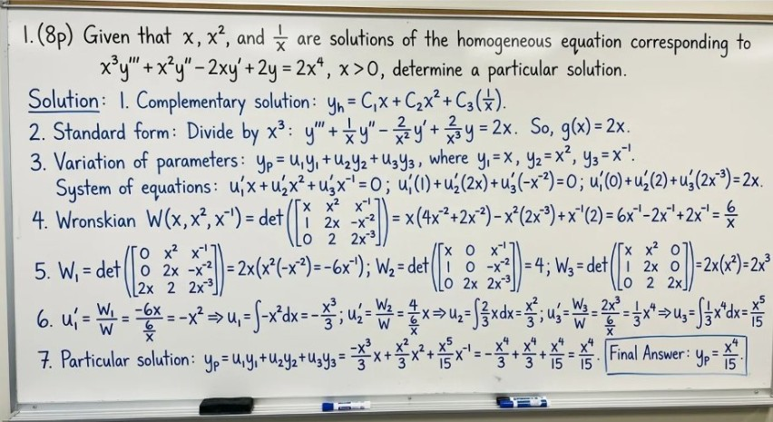 |


**input:** a reference image

**prompt:**

```
solve this math problem and write the full solution on a whiteboard
```

### Case 3: [Assemble message from torn and mixed-up pieces](https://x.com/ai_for_success/status/1988043651445125191/photo/1)（by [@ai_for_success](https://x.com/ai_for_success)）

| Input | Output |
|:---:|:---:|
| 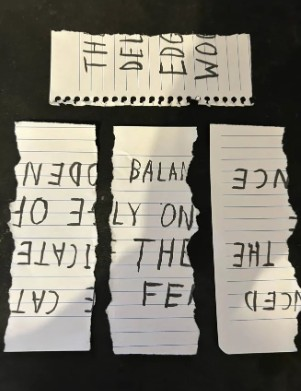 | 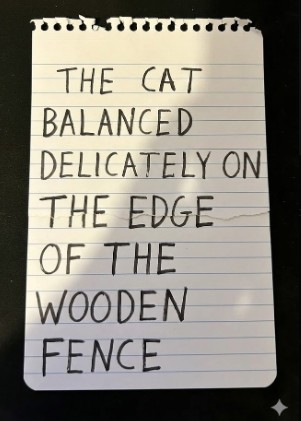 |

**input:** a reference image

**prompt:**

```
assemble the original message from the torn and mixed-up pieces
```

### Case 4: [Anime style to Live-action image](https://x.com/wanerfu/status/1992126414330712232)（by [@wanerfu](https://x.com/wanerfu)）

| Input | Output |
|:---:|:---:|
| 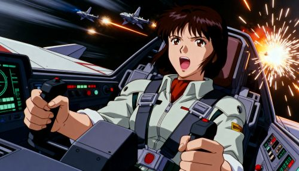 | 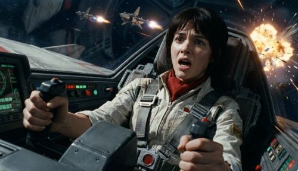 |

**input:** a reference image

**prompt:**
```
Show me the real-life photo version of Image 1
```
```
给我看看图片1的真人拍摄版本。
```


### Case 5: [Live-action image to Anime style](https://x.com/TWnese/status/1992433829391540232)（by [@TWnese](https://x.com/TWnese)）

([Original post source link](https://x.com/TWnese/status/1992433829391540232) / [Author](https://x.com/TWnese))

| Input | Output |
|:---:|:---:|
| 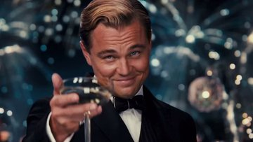 |  |

**input:** a reference image

**prompt:**
```
Show me the animation style image version of Image 1
```
```
给我看看图片1的动漫版本。
```


### Case 6: [Watercolor-ink style series comic](https://copictor.com/case/nanobananapro)（by [@ZizheRuan](https://x.com/ZizheRuan)）

| Input | Output |
|:---:|:---:|
|  | 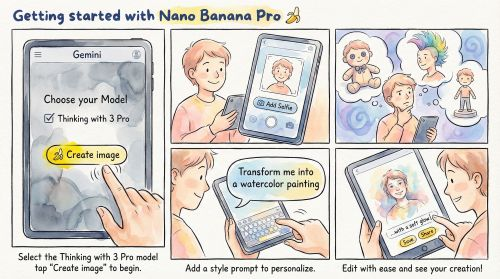 |

**input:** text prompt only

**prompt:**
```
Create a comic with the title: Getting started with Nano Banana Pro 🍌. Panel 1: A mobile interface on Gemini, rendered in a poetic watercolor-ink style with fine ink outlines and soft, bleeding washes. The interface is friendly and a hand painted with expressive brushwork taps a prominent button labeled “🍌 Create image”. Above the button it should say “Choose your Model” then below there should be a checkbox that says “Thinking with 3 Pro” Muted greys and blues dominate the background. The button has a vivid yellow accent. “ Select the Thinking with 3 Pro model” and tap "Create image" to begin. Panel 2: A cheerful person is depicted adding their selfie from the phone’s camera. The user's face is drawn with soft outlines and warm pastel colors, while the phone and UI maintain the delicate water-ink aesthetic. Visible paper grain adds to the texture. Panel 3: The person thinks about what to create. In the background, different options are visualized to show what they’re thinking, including — them as a plushie, them with a mohawk hairstyle, and a figurine. These options are clearly rendered behind the person in the same style as the rest of the comic. Panel 4: The person is shown adding a style prompt, with a speech bubble saying “Transform me into a watercolor painting”. The text is integrated into the panel's watercolor-ink look, and the interaction feels natural and intuitive. Panel 5: The person is seen editing the image by simply typing into Gemini. The scene captures the ease of this interaction, with the final edited image, now in a watercolor style, appearing on the screen. The overall tone is friendly, instructional, and inspiring. It feels like a mini tutorial comic, all conveyed through the specified delicate water-ink illustration style. Make the aspect ratio 16:9.
```


### Case 7: [Futuristic commercial website advertisement with text](https://aijustbetter.com/auth/register)（by [@ZizheRuan](https://x.com/ZizheRuan)）

| Input | Output |
|:---:|:---:|
|  | 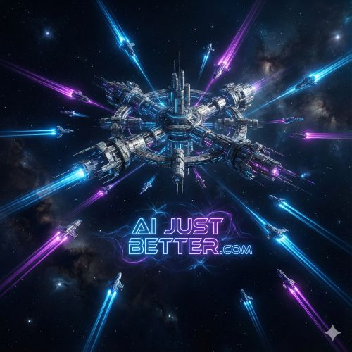 |

**input:** text prompt only

**prompt:**
```
Generate an image of movie style realistic spaceship hub in universe, it is routing, transmitting and ejecting small spaceships in different shapes into different directions and destinations, with their path can be seen, in overall dark space theme mode, with colors of #008ffc and #ff0fdb as main theme colors, in futuristic and space oddesey style, with text "AI JUST BETTER.COM" vividly shown in a fancy and goodlooking way in the center of the image but not cover on the spaceship. Feels like in the real universe space. Make the aspect ratio 1:1.
```


### Case 8: [Create picture by location and time](https://x.com/minchoi/status/1992272691622264841)（by [@minchoi](https://x.com/minchoi)）

| Input | Output |
|:---:|:---:|
|  |  |

**input:** text prompt only

**prompt:**
```
Create an image of 36.4602° N 25.3730° E at sunset
```


### Case 9: [Recursive photograph with time stamp](https://x.com/goodside/status/1992038915881029641)（by [@goodside](https://x.com/goodside)）

| Input | Output |
|:---:|:---:|
|  |  |

**input:** text prompt only

**prompt:**
```
Amateur photograph from 1998 of a middle-aged artist copying an image by hand from a computer screen to an oil painting on stretched canvas, but the image is itself the photo of the artist painting the recursive image.
```


### Case 10: [Traditional color ink painting with modern cartoon characters](https://x.com/dotey/status/1992366309288595681)（by [@dotey](https://x.com/dotey)）

| Input | Output |
|:---:|:---:|
|  |  |

**input:** text prompt only

**prompt:**
```
A traditional Chinese ink and color painting in Gongbi style on aged rice paper texture. A noblewoman in elaborate Tang Dynasty Hanfu robes sits on a wooden stool, holding a modern hairdryer to dry her long flowing hair. She is wearing black stockings, red high heels on one foot, resting on a small stool. 

Three Minions dressed in ancient Chinese servant robes and hats attend to her: one on the left looks stressed holding the hairdryer's power cord, one center kneels polishing her red shoe with a cloth, and one on the right holds up a smartphone taking a photo for her. The background features classical gnarled pine trees, bamboo groves, and Taihu rocks. 

Traditional Chinese calligraphy written in the top right corner, accompanied by a red artist chop seal (寶玉). The color palette is muted mineral pigments. Humorous, anachronistic fusion. --ar 16:9
```


### Case 11: [Hand drawn schematic diagram from photo](https://x.com/alisa_fortin/status/1992477157336195411)（by [@alisa_fortin](https://x.com/alisa_fortin)）

| Input | Output |
|:---:|:---:|
| 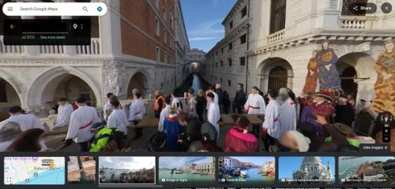 | 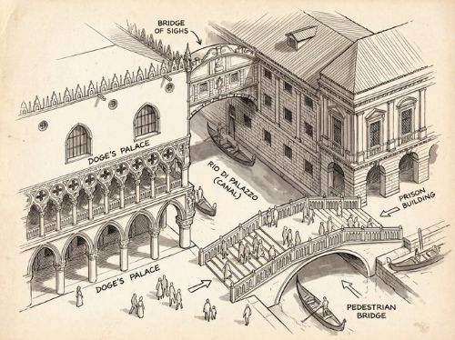 |

**input:** a reference image

**prompt:**
```
 Create a hand drawn isometric schematic diagram of this street.
```


### Case 12: [Photo style picture from hand drawn schematic diagram](https://x.com/citychittagong1/status/1992543203493638491)（by [@citychittagong1](https://x.com/citychittagong1)）

| Input | Output |
|:---:|:---:|
| 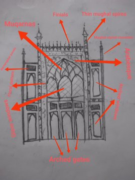 | 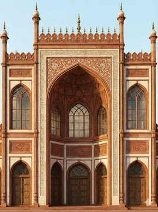 |

**input:** a reference image

**prompt:**
```
 Create a photo from this hand drawn isometric schematic diagram.
```

### Case 13: [Hand drawn schematic diagram from text](https://x.com/alloysiusattah/status/1992726497363444113)（by [@alloysiusattah](https://x.com/alloysiusattah)）

| Input | Output |
|:---:|:---:|
|  | 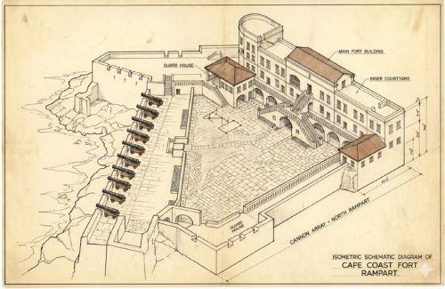 |

**input:** text prompt only

**prompt:**
```
 Create a hand drawn isometric schematic diagram of the Cape Coast Castle, Ghana.
```


### Case 14: [Hand-drawn white outlines to depict figure pose](https://x.com/ZeroZ_JQ/status/1992731775240696232)（by [@ZeroZ_JQ](https://x.com/ZeroZ_JQ)）

| Input | Output |
|:---:|:---:|
|  | 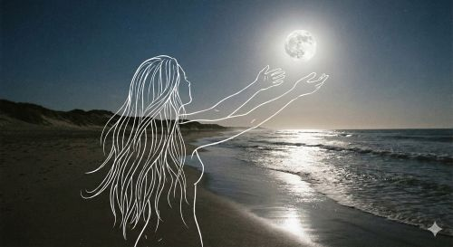 |

**input:** text prompt only

**prompt:**
```
Generate a close-up shot of a long-haired woman on a moonlit beach at night, using hand-drawn white outlines to depict the figure's pose. Do not show facial features, include only one person, avoid outlining other objects with frames, and exclude any text. This description is intended for guiding the model's posing.
```
```
生成一张夜晚月亮下的沙滩长发女性的中及教景特写照片，通过手绘白色线条轮廓展示人物动作， 不要出现人脸，只需要一个人，其他物品不允许使用线框，不要有文字，需要用来指导模特做动作使用。
```


### Case 15: [A two-panel technical blueprint diagram](https://x.com/egeberkina/status/1992173777518813266)（by [@egeberkina](https://x.com/egeberkina)）

| Input | Output |
|:---:|:---:|
|  |  |

**input:** text prompt only

**prompt:**
```
A two-panel technical blueprint diagram in clean monochrome line-art, matching the exact layout of the provided PlayStation 1 schematic. On the left side, draw a full, intact Sony PlayStation 5 console in precise thin line-art on a white background. On the right side, draw a highly detailed, vertically exploded-view diagram of the PS5 showing each internal component separated into layers: outer shell panels, faceplates, cooling fan, heatsink tower, Blu-ray drive, motherboard, SSD module, power supply, internal frame, ports, vents, base stand, screws. Use consistent thin grey line-weight with no shading. Add numbered circular labels around each part, and include a matching numbered parts list at the bottom just like the reference blueprint. Place the SONY logo, PlayStation logo, and “PlayStation 5” text in the top left in the exact same position and style as the uploaded reference image. The entire artwork should mirror the composition, spacing, typography, and minimalist engineering-manual aesthetic of the reference diagram.
```


### Case 16: [3D fluffy logo](https://x.com/gizakdag/status/1991606990448259094)（by [@gizakdag](https://x.com/gizakdag)）

| Input | Output |
|:---:|:---:|
|  |  |

**input:** text prompt only

**prompt:**
```
Transform Google's G logo into a soft, 3D fluffy object. Use the exact colors. The shape is fully covered in fur, with hyperrealistic hair texture and soft shadows. The object is centered on a clean, light gray background and floats gently in space. The style is surreal, tactile, and modern, evoking a sense of comfort and playfulness. Studio lighting, high-resolution render.
```


### Case 17: [Landmark Infographics](https://x.com/TechieBySA/status/1991820056377078179)（by [@TechieBySA](https://x.com/TechieBySA)）

| Input | Output |
|:---:|:---:|
|  |  |

**input:** text prompt only

**prompt:**
```
Create an infographic image of [LANDMARK], combining a real photograph of the landmark with blueprint-style technical annotations and diagrams overlaid on the image. Include the title “[LANDMARK]” in a hand-drawn box in the corner. Add white chalk-style sketches showing key structural data, important measurements, material quantities, internal diagrams, load-flow arrows, cross-sections, floor plans, and notable architectural or engineering features. Style: blueprint aesthetic with white line drawings on the photograph, technical/architectural annotation style, educational infographic feel, with the real environment visible behind the annotations.
```


### Case 18: [Google map style graphics](https://x.com/alex_prompter/status/1993012863594905631)（by [@alex_prompter](https://x.com/alex_prompter)）

| Input | Output |
|:---:|:---:|
|  |  |

**input:** text prompt only

**prompt:**
```
Google Street View, coordinates [COORDINATES]
```


### Case 19: [3D Topology](https://x.com/alex_prompter/status/1992971116516876751)（by [@alex_prompter](https://x.com/alex_prompter)）

| Input | Output |
|:---:|:---:|
|  |  |

**input:** text prompt only

**prompt:**
```
The 3D "Loss Landscape" Topology
```


### Case 20: [Inner scientific machines](https://x.com/alex_prompter/status/1992971116516876751)（by [@alex_prompter](https://x.com/alex_prompter)）

| Input | Output |
|:---:|:---:|
|  |  |

**input:** text prompt only

**prompt:**
```
Tokamak Fusion Reactor Magnetic Field Lines
```


### Case 21: [Scientific Scatter Plot](https://x.com/alex_prompter/status/1992971116516876751)（by [@alex_prompter](https://x.com/alex_prompter)）

| Input | Output |
|:---:|:---:|
|  |  |

**input:** text prompt only

**prompt:**
```
Visualizing the "Latent Space" (t-SNE Scatter Plot)
```


### Case 23: [8-bit style map](https://x.com/FinanceYF5/status/1993221813741228528)（by [@Mr_AllenT](https://x.com/Mr_AllenT)）

| Input | Output |
|:---:|:---:|
|  |  |

**input:** text prompt only

**prompt:**
```
1.8-bit Style San Francisco
```
```
1.8-bit 风格的旧金山
```


### Case 24: [rate your face symmetry](https://x.com/Samann_ai/status/1992171138730885618)（by [@Samann_ai](https://x.com/Samann_ai)）

| Input | Output |
|:---:|:---:|
|  |  |

**input:** text prompt only

**prompt:**
```
Use the provided portrait photo <YOUR PHOTO> as the base. 
Do NOT change the person’s face, expression, age, skin tone or gender. Just overlay a clean, minimal infographic on top.
Create a high-resolution vertical “FACIAL AESTHETIC REPORT” poster, studio lighting, soft beige background, premium beauty clinic style.
The subject can be MALE or FEMALE – keep them exactly as in the original photo. 
Add thin white lines and labels pointing to each area of the REAL face, with percentage scores based on global aesthetic ratios, symmetry and proportions (not changing the face):
1. Eyes:
   Label near the eyes with a line pointing to them:
   “Eyes Beauty – 0–100%”
   Example: “Eyes Beauty – 92%”
2. Cheeks:
   Label near the cheekbones:
   “Cheeks Harmony – 0–100%”
   Example: “Cheeks Harmony – 85%”
3. Lips:
   Label close to the mouth:
   “Lips Shape – 0–100%”
   Example: “Lips Shape – 88%”
4. Eyebrows:
   Label above or beside the brows:
   “Eyebrows Design – 0–100%”
   Example: “Eyebrows Design – 80%”
5. Jaw & Chin:
   Label near the jawline and chin:
   “Jaw & Chin Definition – 0–100%”
   Example: “Jaw & Chin Definition – 90%”
6. Overall Facial Symmetry:
   Label near the center of the face:
   “Facial Symmetry – 0–100%”
   Example: “Facial Symmetry – 89%”
At the bottom center of the poster, add a BIG, bold number inside a circle or rectangle:
   “OVERALL SCORE: XX%”
This is the total facial aesthetic score from 1–100%.
Design style:
– clean, medical-grade, aesthetic-clinic infographic
– modern thin sans-serif typography
– white text and lines, subtle drop shadows
– no logos, no extra graphics, no text other than the labels and scores above.
```


### Case 25: [Age checker](https://x.com/Samann_ai/status/1992171138730885618)（by [@Samann_ai](https://x.com/Samann_ai)）

| Input | Output |
|:---:|:---:|
|  |  |

**input:** text prompt only

**prompt:**
```
A hyper-realistic, high-resolution portrait infographic based on (your photo). Keep the same person, identity, hairstyle, clothing and natural skin tone from (your photo), with a neutral studio background.Overlay a subtle, semi-transparent facial analysis grid on the entire face, very similar to a 3D face-scanning mesh: thin, soft white lines following the facial contours, slightly glowing but not hiding the skin details. Add one clean vertical red laser line running down one side of the face, like a futuristic scan. All analysis lines must be soft, minimal and elegant, exactly like a cosmetic-tech advertisement.Create a clean medical–aesthetic infographic that evaluates 5 aging factors using global data percentages:1. Fine lines and wrinkles2. Skin texture and elasticity3. Facial volume and sagging4. Eye area aging signs5. Skin tone and pigmentationFor each factor, place a small label with a thin line pointing to the relevant facial area, and next to it write a short title and a realistic percentage score from 0–100% (based on global data), for example:“Fine lines & wrinkles – 18%”“Skin texture & elasticity – 72%”“Facial volume & sagging – 35%”“Eye area aging signs – 41%”“Skin tone & pigmentation – 63%”Use clean, modern, sans-serif typography and small technical-style text, like a scientific facial analysis UI. At the bottom of the image, in the center, write a large bold text showing the final estimated real age based on the analysis, for example:“ESTIMATED AGE: (random number based on face analysis ) ”Overall style: futuristic AI-guided skincare analysis, minimalistic, premium editorial lighting, no gender mentioned, suitable for any human face.
```


### Case 26: [Draw language learning scenario picture](https://x.com/crystalsssup/status/1993225494410805623)（by [@crystalsssup](https://x.com/crystalsssup)）

| Input | Output |
|:---:|:---:|
|  | 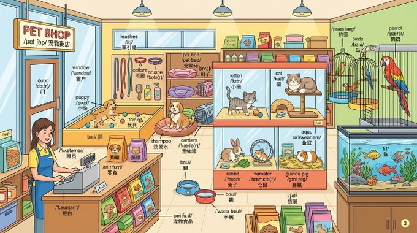 |

**input:** text prompt only

**prompt:**
```
Draw a detailed {{pet shop}} scene and label every object with English words.

Label format: 
- First line: English word 
- Second line: IPA pronunciation 
- Third line: {Chinese} translation
```


### Case 27: [Create a realistic photo of a cartoon character](https://x.com/gizakdag/status/1993230357328441376)（by [@gizakdag](https://x.com/gizakdag)）

| Input | Output |
|:---:|:---:|
| 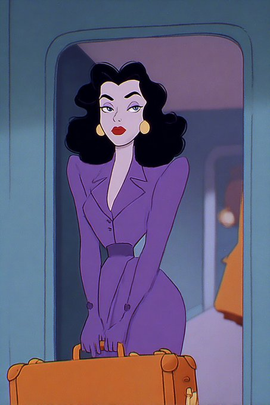 | 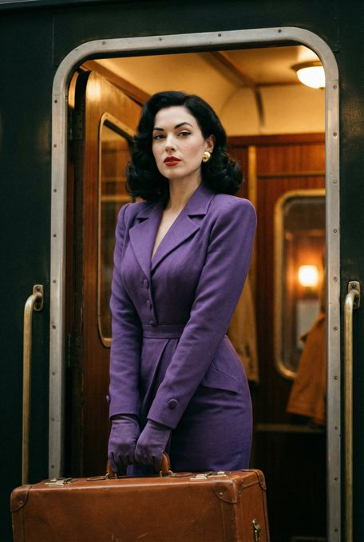 |

**prompt:**
```
Create a realistic photo of this character
```


### Case 28: [Restore sketches from logo](https://x.com/riomadeit/status/1993397495205183509)（by [@riomadeit](https://x.com/riomadeit)）

| Input | Output |
|:---:|:---:|
| 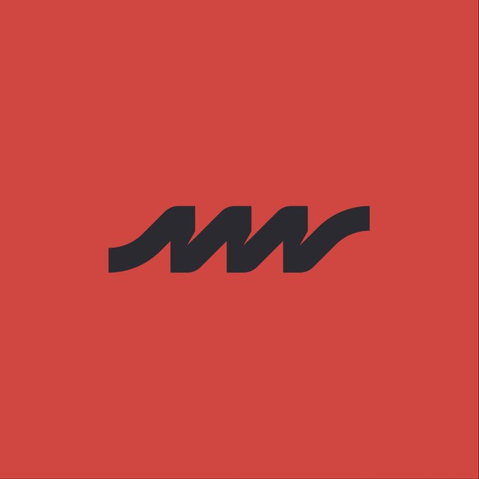 | 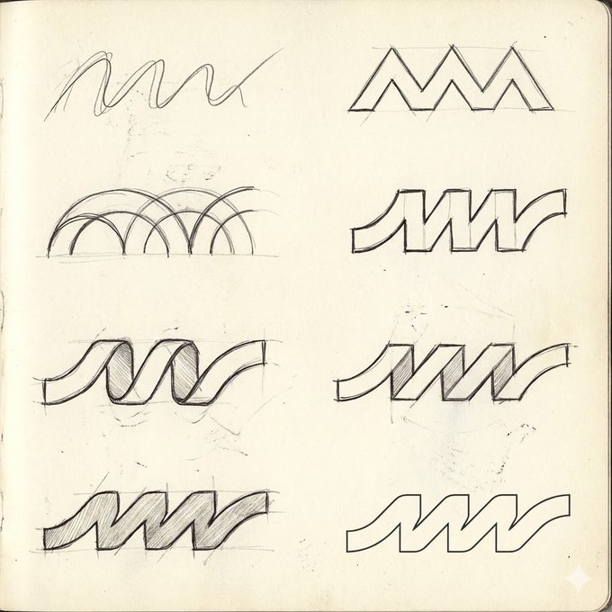 |

**prompt:**
```
Create 8 different initial sketches leading to this final logo design
```


### Case 29: [Solve math question on notebook](https://x.com/immasiddx/status/1991918223454003346)（by [@immasiddx](https://x.com/immasiddx)）

| Input | Output |
|:---:|:---:|
| 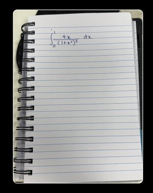 | 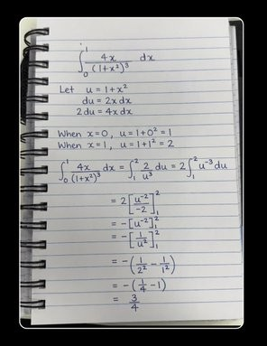 |

**prompt:**
```
solve it correctly in my actual handwriting
```


### Case 30: [Recreate Britney at VMAs](https://x.com/shoolian/status/1991793665463795817)（by [@shoolian](https://x.com/shoolian)）

| Input | Output |
|:---:|:---:|
|  | 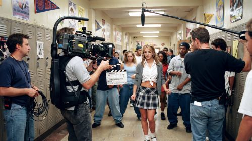 |

**prompt:**
```
A live television cameraman with MTV broadcast equipment capturing Britney Spears’ shocking performance with a live albino Burmese python draped around her shoulders, Radio City Music Hall VMAs stage with elaborate jungle-themed set design, professional awards show production documenting pop culture controversy, iconic MTV moment being broadcast live to millions, realistic 2001 awards show environment with authentic VMAs staging and dramatic stage lighting, shot on broadcast television cameras with multiple angles capturing audience shock, crew documenting the performance that became one of the most memorable VMAs moments ever and cemented Britney’s transition from teen pop to adult artist.
```


### Case 31: [Turn item into cyberpunk style with text](https://copictor.com/model/nanobananapro)（by [@ZizheRuan](https://x.com/ZizheRuan)）

| Input | Output |
|:---:|:---:|
|  | 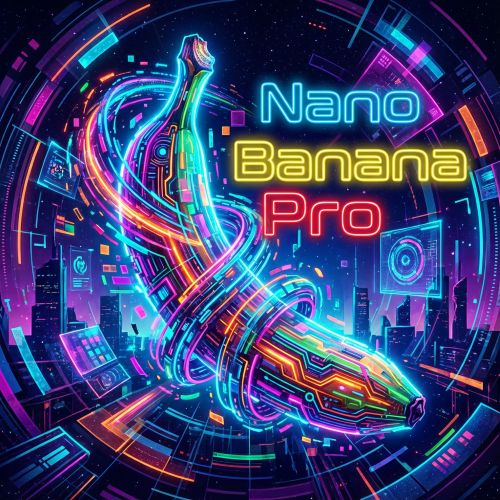 |


**input:** a reference image

**prompt:**

```
A highly imaginative, ultra-cool, eye-catching cyberpunk-inspired banana artwork in vivid, neon-saturated colors. A single banana occupies most of the frame, rendered in a surreal, futuristic, abstract style that clearly does not resemble the real world. 1:1 aspect ratio. Add three lines of English text: ‘Nano’, ‘Banana’, ‘Pro’. The text should not block the banana too much, but may slightly overlap if needed. Extremely stylish, futuristic, and visually striking.
```
```
以香蕉为主题，生成一张最炫酷吸睛，色彩鲜艳的香蕉主题图片，可以是抽象的赛博朋克主题，场景要非常炫酷，一看就不是真实世界，而是高度想象力的，横纵比例1:1，香蕉要占据主要面积，图上加三行英文文字，分别是"Nano""Banana""Pro"，尽量不要挡住香蕉，但也可以盖在一小部分香蕉上面，不要出现中文
```


### Case 32: [Mock Canva on laptop screen](https://x.com/Parul_Gautam7/status/1992965275160019102)（by [@Parul_Gautam7](https://x.com/Parul_Gautam7)）

| Input | Output |
|:---:|:---:|
|  | 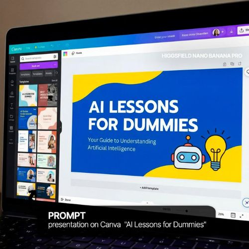 |

**prompt:**
```
presentation on Canva "AI lessons for dummies"
```


## 🙏 Acknowledge
All images and prompts included here are collected from **publicly shared sources** or generated through legitimate Apps/APIs**.  
This repository does **not** host internal, leaked, or proprietary data.
Cases come from X.com, RedNote and other social media. Copyrights credits to original authors and artists. This repo is inspired by projects awesome-nano-banana, awesome-gpt4o-images and Awesome-Nano-Banana-images.